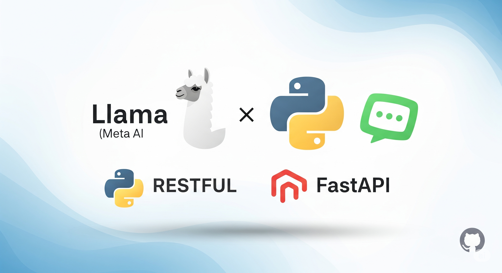
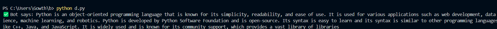
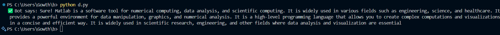

# RESTful - Chatbot
A simple **RESTful chatbot** service in Python using Llama Model



### This project implements a basic RESTful API chatbot service in Python using FastAPI, powered by the TinyLlama language model. It allows users to send messages via HTTP POST requests and receive AI-generated responses.

### STEP 1

### Installation Needed Libraries
 
```
pip3 install torch torchvision torchaudio --index-url https://download.pytorch.org/whl/cu126
pip install -r requirements.txt
```

### STEP 2 

### Setup ⚙ 
Create a .env file in the root directory:

```
Hf_Token = " your_huggingface_token_here "
```

Login or Signup Hugging Face through : https://huggingface.co/

Create a token and copy it you can get your Hugging Face token from: https://huggingface.co/settings/tokens

### STEP 3

### Running the Server
Run the file **bot.py** by
Starting the FastAPI chatbot server with:

```
uvicorn bot:app --reload
```

Once running, the API will be available at:

```
http://127.0.0.1:8000
```

### STEP 4

### Testing the Chatbot
You can test the chatbot by running the file data.py

```
python data.py
```

### RESULT:





### CHAT_LOG
Every time you ask a question and receive a response from the bot, the conversation is automatically saved in a file named `chat_log.txt`.
This log includes:

**User message**
**Bot reply and**
**Timestamp**

Useful for debugging, reviewing conversation history


### Features:

**RESTful API:** Exposes a /chat endpoint for conversational interaction.

**Llama Integration:** Uses the **TinyLlama-1.1B-Chat-v1.0** model for response generation.

**FastAPI Backend:** Built with FastAPI for high performance and easy API development.

**Hugging Face Integration:** Loads models from Hugging Face Hub using a token.

**GPU Acceleration:** Automatically leverages CUDA (GPU) if available for faster inference, otherwise falls back to CPU.

**Conversation Logging:** Records all user inputs and bot responses to a log file.

**Simple Client:** Includes a basic Python script to demonstrate interacting with the service.


### Note:

## This project uses the TinyLlama 1.1B Chat model:
https://huggingface.co/TinyLlama/TinyLlama-1.1B-Chat-v1.0
Use this Model for best performance, run on a machine with a GPU.
